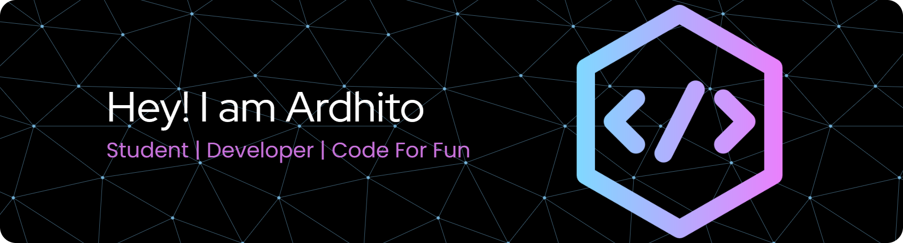

## Hi there, I'm Ardhito 👋

- 🔭 I’m currently working on small campus project
- 🌱 I’m currently learning [**Laravel**](https://laravel.com/) Framework
- 📫 How to reach me:

##### Skills

<!-- Bahasa Pemrograman -->

<!-- Database -->

<!-- Tools -->

<!-- Framework -->

<!-- Library -->

### 📊 GitHub Stats

